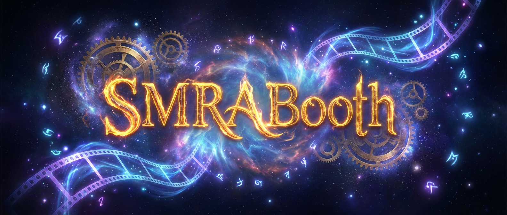
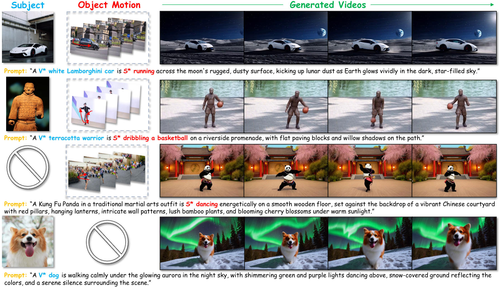

<p align="center" >
    
</p>

# <div align="center" >Subject-Motion Representation Alignment for Customized Video Generation<div align="center">

<div align="center">
  <p>
    <a href="https://xuxuancheng0208.github.io/">Xuancheng Xu</a><sup>1</sup>
    <a href="">Yaning Li</a><sup>1</sup>
    <a href="">Sisi You</a><sup>1,✉</sup>
    <a href="https://www.scholat.com/bkbao.en">Bing-Kun Bao</a><sup>1,2</sup>
  </p>
  <p>
    <sup>1</sup>Nanjing University of Posts and Telecommunications &nbsp;&nbsp;
    <sup>2</sup>Peng Cheng Laboratory &nbsp;&nbsp;
    <sup>✉</sup>Corresponding author
  </p>
</div>

<br>

<p align="center">
  <a href='https://smrabooth.github.io/'></a>
  &nbsp;
  <a href="https://arxiv.org/abs/2512.12193"></a>
  &nbsp;
  <a href=''></a>
</p>

## 📝 Abstract
<p align="center" >
    
</p>
Customized video generation aims to produce videos that faithfully preserve the subject's appearance from reference images while maintaining temporally consistent motion from reference videos. Existing methods struggle to ensure both subject appearance similarity and motion pattern consistency due to the lack of object-level guidance for subject and motion. To address this, we propose SMRABooth, which leverages the self-supervised encoder and optical flow encoder to provide object-level subject and motion representations. These representations are aligned with the model during the LoRA fine-tuning process. Our approach is structured in three core stages: (1) We exploit subject representations via a self-supervised encoder to guide subject alignment, enabling the model to capture overall structure of subject and enhance high-level semantic consistency. (2) We utilize motion representations from an optical flow encoder to capture structurally coherent and object-level motion trajectories independent of appearance. (3) We propose a subject-motion association decoupling strategy that applies sparse LoRAs injection across both locations and timing, effectively reducing interference between subject and motion LoRAs. Extensive experiments show that SMRABooth excels in subject and motion customization, maintaining consistent subject appearance and motion patterns, proving its effectiveness in controllable text-to-video generation. 

## 🔥 Updates

- **2026.02.18** Our full code for SMRABooth has been released on GitHub!
- **2025.12.13** Our preprint for SMRABooth has been released on arXiv!

## 🎯 To Do List

- [x] Release paper
- [x] Release code
- [ ] Release datasets

## ⚙️ Setup
####  Step 1: Set up the environment
(Tips: This version is optimized for Blackwell architecture)
```python
conda create -n smraboothwan python=3.11
conda activate smraboothwan
pip install torch==2.7.0 torchvision==0.22.0 torchaudio==2.7.0 --index-url https://download.pytorch.org/whl/cu128
cd SMRABooth
pip install -e .
pip install -r requirements.txt


```
#### Step 2: Download the pretrained checkpoint

**WAN-2.1-1.3B**

```bash
modelscope download --model Wan-AI/Wan2.1-T2V-1.3B --local_dir ./ckpts/Wan2.1-T2V-1.3B
```

**SEA-RAFT**

- Download from [Google Drive](https://drive.google.com/drive/folders/1YLovlvUW94vciWvTyLf-p3uWscbOQRWW?usp=sharing)
- Place the checkpoint at: `./ckpts/SEA-RAFT/Tartan-C-T-TSKH-spring540x960-M/Tartan-C-T-TSKH-spring540x960-M.pth`

#### Step 3: Prepare the customized datasets

Download the dataset from XXX. (To be released.) 
Place the data under `./datasets`.

**Directory structure:**

```
datasets/
├── subject_customized/         # Subject LoRA training
│   └── {subject_name}/         # e.g., dog
│       ├── images/             # Subject images
│       ├── masks/              # Segmentation masks 
│       └── metadata.csv        # Prompt
│
└── motion_customized/
    └── video/                  # Motion LoRA training
        └── {motion_name}/      # e.g., skateboarding
            ├── *.mp4           # Video clips
            └── metadata.csv    # Prompt
```


#### Step 4: Train Subject and Motion LoRAs
**Train Subject LoRA**
```bash
bash Wan2.1-T2V-1.3B-Subject.sh
```
**Train Motion LoRA**
```bash
bash Wan2.1-T2V-1.3B-Motion.sh
```

#### Step 5: Inference the final video
```bash
python combine_inference.py
```

## ✉️ Acknowledgement
We would like to express our gratitude to the Wan Team and SEA-RAFT authors for open-sourcing their code and models. Their contributions have been instrumental to the development of this project.

## 📚 Citation
If you find this work useful for your research, please cite our paper:
```bash
@article{xu2025smrabooth,
  title={SMRABooth: Subject and Motion Representation Alignment for Customized Video Generation},
  author={Xu, Xuancheng and Li, Yaning and You, Sisi and Bao, Bing-Kun},
  journal={arXiv preprint arXiv:2512.12193},
  year={2025}
}
```